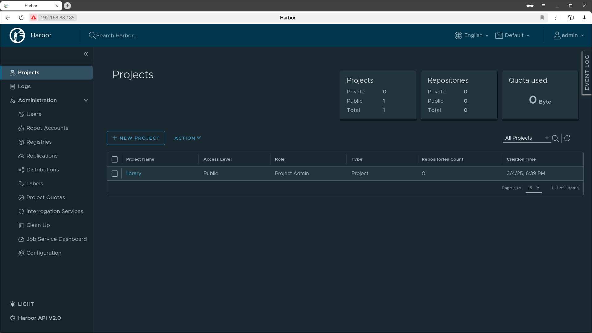
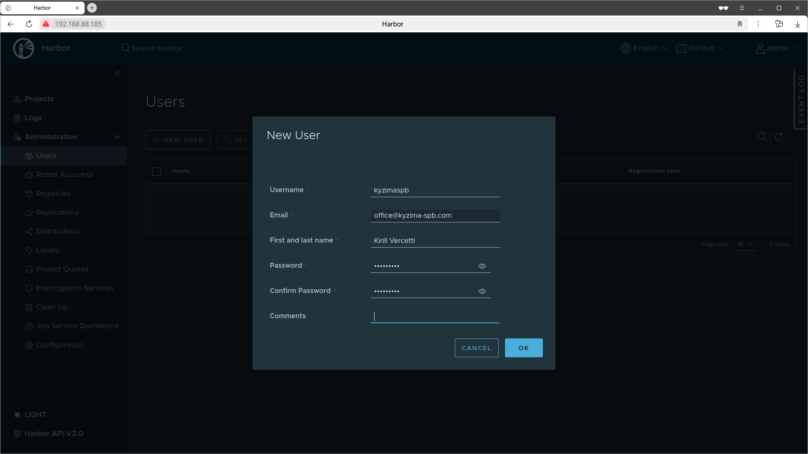
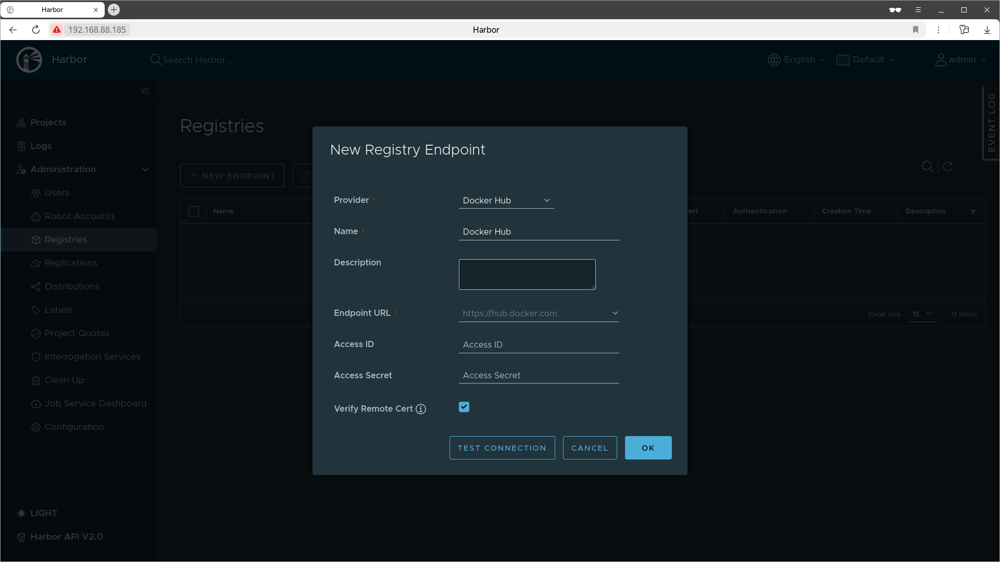
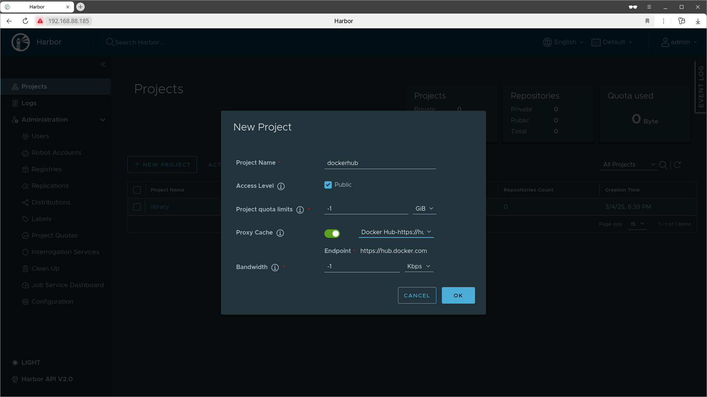
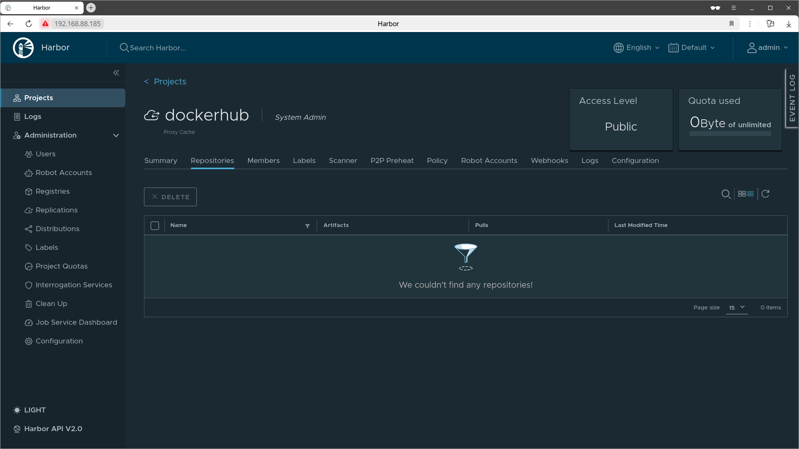
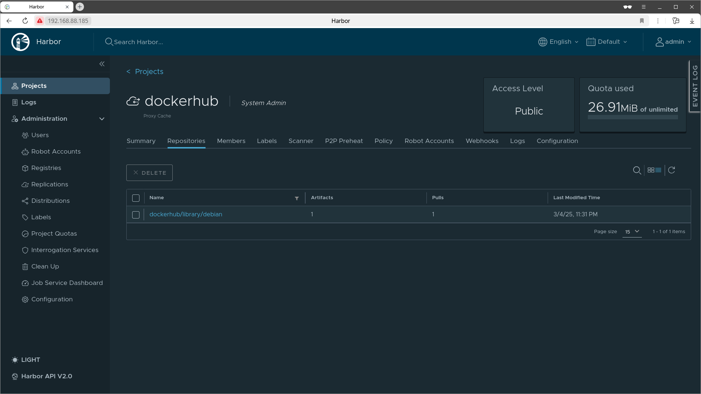
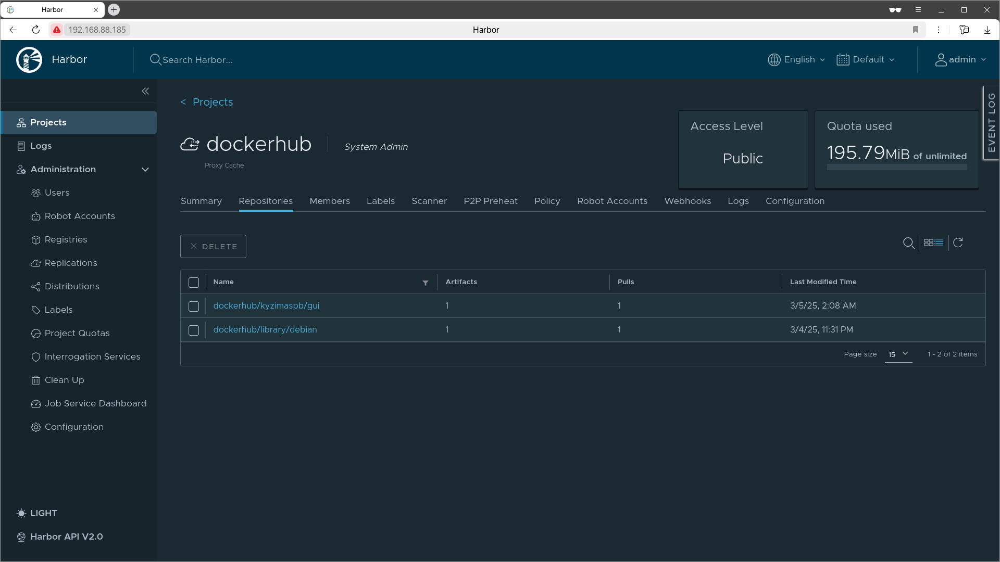
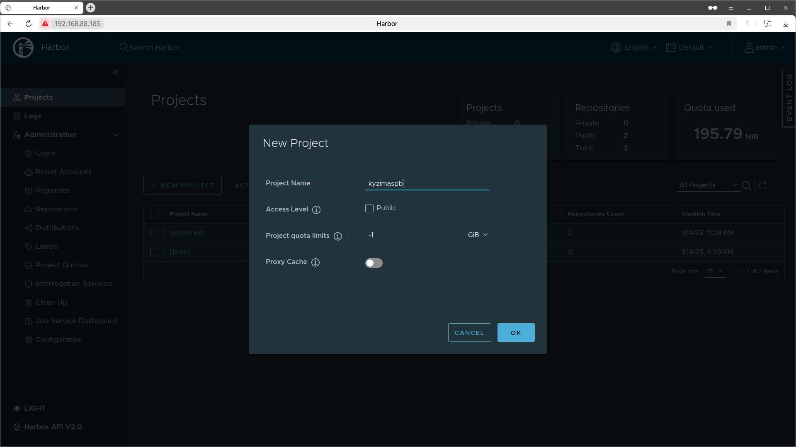
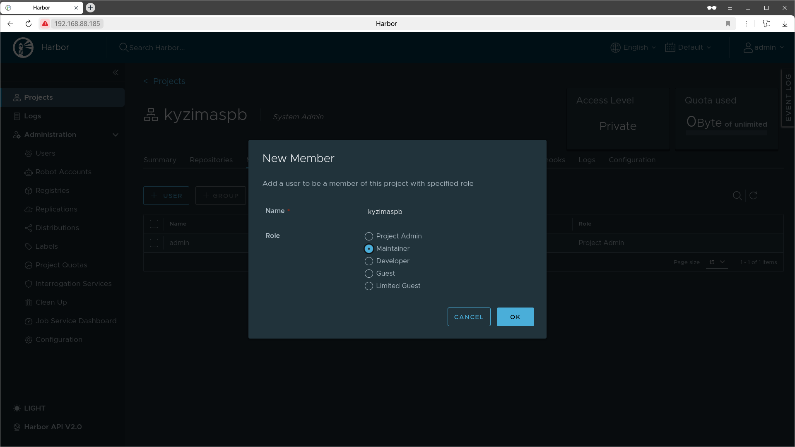
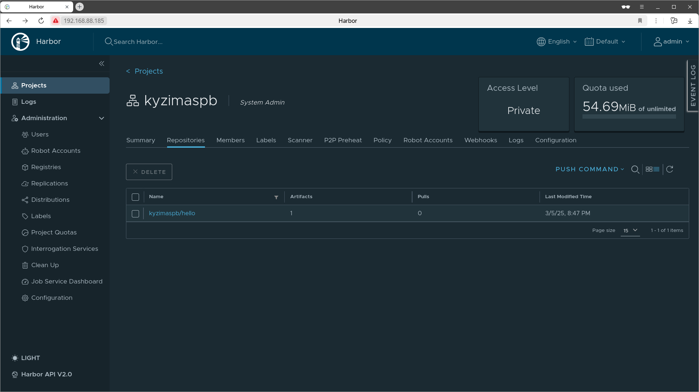

# Harbor

- [Установка, конфигурация и запуск](#установка-конфигурация-и-запуск)
- [Минимальная настройка реестра](#минимальная-настройка-реестра)
  - [Добавляем обычного пользователя](#добавляем-обычного-пользователя)
  - [Добавляем реестры](#добавляем-реестры)
  - [Настройка кеширующего прокси](#настройка-кеширующего-прокси)
  - [Добавляем проекты](#добавляем-проекты)
- [Самоподписанный SSL/TLS сертификат](#самоподписанный-ssltls-сертификат)
  - [Создание сертификата центра сертификации](#создание-сертификата-центра-сертификации)
  - [Создание сертификата сервера](#создание-сертификата-сервера)
  - [Настройка HTTPS доступа к реестру](#настройка-https-доступа-к-реестру)
- [Как добавить CA сертификат в доверенные?](#как-добавить-ca-сертификат-в-доверенные)
  - [Как удалить сертификат из доверенных?](#как-удалить-сертификат-из-доверенных)


[**Harbor**](https://goharbor.io/) - это реестр с открытым исходным кодом,
который защищает артефакты с помощью политик и контроля доступа на основе ролей,
проверяет образы на уязвимости и подписывает их как доверенные.

## Установка, конфигурация и запуск

Следующая команда установит последнюю версию Harbor в директорию `/opt`: 

```shell
wget -qO- https://api.github.com/repos/goharbor/harbor/releases/latest |\
    awk -F'"' '/"browser_download_url"/ {print $(NF-1)}' |\
    grep offline |\
    wget -qO- -i- --show-progress |\
    sudo tar -xzvf - -C /opt
```

Если нужна конкретная версия, то используйте URL:

```
https://api.github.com/repos/goharbor/harbor/releases/tags/<TAG_NAME>
```

Переходим в директорию с распакованным Harbor
и переименовываем шаблон конфигурационного файла, убирая расширение `tmpl`:

```shell
cd /opt/harbor
sudo mv harbor.yml.tmpl harbor.yml
```

Открываем конфигурационный файл и изменяем значения для наиболее важных параметров:

* `hostname` - IP адрес или доменное имя, используется для входа в веб интерфейс и командах Docker
* `http` - Настройки для HTTP подключения
* `https` - Настройки для HTTPS подключения, пока закомментируем
* `harbor_admin_password` - Пароль администратора
* `database.password` - Пароль для пользователя `postgres`
* `data_volume` - Путь к директории, где будут сохранены данные Harbor
  По-умолчанию использует файловую систему, если нужно другое хранилище - читайте документацию

Я буду использовать IP адрес `192.168.88.185`, порт `80` по-умолчанию, без HTTPS,
а данные хранить в директории `/var/lib/harbor`.
Теперь можно запустить установочный скрипт:

```shell
sudo ./install.sh
```

В консоли будет предупреждение о том, что протокол HTTP будет признан устаревшим в будущих версиях.
Игнорируем данное предупреждение, доступ по HTTPS мы настроим позже:

```
WARNING:root:WARNING: HTTP protocol is insecure.
Harbor will deprecate http protocol in the future.
Please make sure to upgrade to https
```

Ждем некоторое время, пока Harbor проинициализирует все нужные сервисы.
Процесс инициализации можно отслеживать командой:

```shell
docker compose logs -f
```

Теперь можно открыть браузер и перейти по адресу, указанному в параметре `hostname`,
если изменили порт с `80`/`443`, то не забудьте указать его явно.
Выполните вход с пользователем `admin` и паролем, указанным в параметре `harbor_admin_password`:



## Минимальная настройка реестра

### Добавляем обычного пользователя

Переходим в `Users` и добавляем нового пользователя:



Если сейчас попытаться аутентифицироваться в реестре, то вы получите ошибку:

```shell
# Error response from daemon: Get "https://192.168.88.185/v2/":
# dial tcp 192.168.88.185:443: connect: connection refused
sudo docker login -u kyzimaspb 192.168.88.185
```

Docker по-умолчанию используется HTTPS.
Чтобы заставить его использовать HTTP,
нужно добавить адрес реестра в список `insecure-registries` в файле `/etc/docker/daemon.json`.
Если такой файл не существует, его нужно создать:

```json
{
  "insecure-registries" : ["192.168.88.185"]
}
```

Перезапускаем демона Docker и если вы аутентифицируетесь с той же машины, где установлен Harbor,
то желательно перезапустить и его, т.к. у меня с ним были проблемы и часть служб отваливалась:

```shell
sudo systemctl restart docker
sudo docker compose down
sudo docker compose up -d
```

Теперь можно повторно выполнить аутентификацию в реестре,
если вы все сделали верно, то получите ответ `Login Succeeded`.

### Добавляем реестры

Скорее всего вы захотите использовать привычные образы из DockerHub или GitHub GHCR.
Переходим в `Registries` и добавляем новый реестр на примере DockerHub:



Если вам нужно получать образы из частных репозиториев, то можно указать `Access ID` и `Access Secret`,
для DockerHub это имя пользователя и токен доступа,
который можно получить в настройках аккаунта, пункт `Personal access tokens`.

Для добавления GitHub GHCR повторите шаги, но выберите из выпадающего списка `GitHub GHCR`.

### Настройка кеширующего прокси

Проекты в Harbor можно разделить на две группы:

1. Проект, который хранит образы текущего реестра
2. Проект прокси-кеша, который кеширует загружаемые образы из целевого реестра

Прокси-кеш позволяет:

* сократить количество запросов к целевому реестру
* увеличить скорость загрузки образов за счет их наличия в кеше
* автоматически обновлять кеш если манифест изменился
* работать автономно, когда целевой реестр не доступен, но образ есть в кеше
* использовать сохраненную копию образа даже если он был удален из целевого реестра

Переходим в `Projects` и создаем новый проект с именем `dockerhub`
с включенным прокси-кешем для ранее добавленного реестра `Docker Hub`.
По желанию можно сделать проект публичным:



Если открыть только что созданный проект, то он не будет содержать ни одного образа:



Выполним загрузку образа `debian:bookworm-slim` используя наш прокси-кеш.
Это официальный образ, который можно загружать не указываю пространство имен,
поэтому имя образа для загрузки будет иметь вид: `адрес_реестра_harbor/имя_проекта/имя_образа:тег`:

```shell
docker pull 192.168.88.185/dockerhub/debian:bookworm-slim
```

Если открыть проект `dockerhub`, то мы увидим загруженный образ:



Выполним загрузку образа `kyzimaspb/gui:bookworm-slim` используя наш прокси-кеш.
Это пользовательский образ, поэтому необходимо указать пространство имен.
Имя образа для загрузки будет иметь вид: `адрес_реестра_harbor/имя_проекта/имя_пользователя/имя_образа:тег`:

```shell
docker pull 192.168.88.185/dockerhub/kyzimaspb/gui:bookworm-slim
```

Если открыть проект `dockerhub`, то мы увидим загруженный образ:



### Добавляем проекты

Я бы сравнил проекты с пространствами имен в реестре DockerHub.
Поэтому создадим проект с именем пользователя.
Переходим в `Projects` и создаем новый проект с именем `kyzimaspb`:



Открываем только что созданный проект и переходим во вкладку `Members`.
Добавляем пользователя в проект, можно выбрать любую подходящую роль,
в моем случае это `Maintainer`:



Соберем тестовый образ и загрузим его в проект `kyzimaspb`:

```bash
docker build -t 192.168.88.185/kyzimaspb/hello - <<EOF
FROM 192.168.88.185/dockerhub/debian:bookworm-slim
CMD ["echo", "Hello, Docker!"]
EOF

# Просмотр образов из реестра Harbor
# Образ 192.168.88.185/kyzimaspb/hello с тегом latest должен появиться в списке
docker images | grep 192.168.88.185

docker push 192.168.88.185/kyzimaspb/hello
```

Теперь если перейти на вкладку `Repositories` проекта `kyzimaspb`,
то вы должны увидеть только что загруженный образ:



## Самоподписанный SSL/TLS сертификат

Настроим HTTPS подключение к реестру Harbor используя самоподписанный сертификат.

```shell
# Создаем директорию для хранения сертификатов и ключей
sudo mkdir -p /opt/harbor/cert

# Переходим в созданную директорию
cd /opt/harbor/cert
```

### Создание сертификата центра сертификации

Создаем закрытый ключ RSA длиной 4096 бит и сохраняем в файл `ca.key`: 

```shell
sudo openssl genrsa -out ca.key 4096
```

Следующей командой создаем самоподписанный корневой сертификат (Root CA)
и соответствующий закрытый ключ. Аргументы команды:

* `-new` - создать новый сертификат
* `-x509` - сгенерировать самоподписанный сертификат вместо запроса на подпись
* `-nodes` - приватный ключ не будет зашифрован паролем
* `-sha512` - задает алгоритм хеширования для подписи сертификата
* `-days` - срок действия сертификата в днях - 3650 дней (10 лет)
* `-subj` - данные субъекта сертификата:
  * `C=RU` - страна
  * `ST=State` - штат или регион
  * `L=City` - город 
  * `O=Organization` - организация
  * `OU=Personal` - организационное подразделение
  * `CN=Harbor Root CA` - обычно указывает на владельца сертификата
* `-keyout` - закрытый ключ, который необходимо хранить в безопасности
* `-out` - сертификат, который можно использовать для подписи других сертификатов или доверять ему в системе

```shell
sudo openssl req -new -x509 -nodes -sha512 -days 3650 \
    -subj "/C=RU/CN=Harbor Root CA" \
    -keyout ca.key \
    -out ca.crt
```

### Создание сертификата сервера

Создаем закрытый ключ RSA длиной 4096 бит и сохраняем в файл `192.168.88.185.key`.
Вместо IP-адреса можно использовать доменное имя, если оно у вас есть:

```shell
sudo openssl genrsa -out 192.168.88.185.key 4096
```

Создаем запрос на подписание сертификата (CSR), аргументы команды:

* `-new` - создать новый запрос
* `-sha512` - задает алгоритм хеширования
* `-subj` - данные субъекта:
  * `C=RU` - страна Россия
  * `CN=192.168.88.185` - указывает либо на доменное имя,
    либо на IP-адрес сервера, для которого запрашивается сертификат
* `-key` - закрытый ключ для подписи запроса
* `-out` - сохранить созданный запрос на подпись сертификата в указанный файл

```shell
sudo openssl req -new -sha512 \
    -subj "/C=RU/CN=192.168.88.185" \
    -key 192.168.88.185.key \
    -out 192.168.88.185.csr
```

Создадим файл конфигурации `v3.ext`.
Независимо от того, используете ли вы FQDN или IP-адрес для подключения к хосту Harbor,
вам нужно создать этот файл, чтобы сгенерировать сертификат,
соответствующий требованиям SAN и расширения x509 v3.
Замените DNS-записи в соответствии с вашим доменом:

```shell
sudo tee v3.ext >/dev/null <<-EOF
authorityKeyIdentifier=keyid,issuer
basicConstraints=CA:FALSE
keyUsage = digitalSignature, nonRepudiation, keyEncipherment, dataEncipherment
extendedKeyUsage = serverAuth
subjectAltName = @alt_names

[alt_names]
DNS.1=harbor.loc
IP.1 = 192.168.88.185
EOF
```

Теперь используя файл `v3.ext` создадим сертификат для хоста Harbor.
Аргументы команды:

* `x509` - работаем с сертификатами X.509
* `-req` - сертификат должен быть создан на основе запроса на подпись сертификата (CSR)
* `-sha512` - задает алгоритм хеширования для подписи сертификата
* `-days` - срок действия сертификата в днях - 3650 дней (10 лет)
* `-extfile` - файл конфигурации `v3.ext`, содержащий дополнительные расширения сертификата
* `-CA` - сертификат центра сертификации (CA), который будет подписывать новый сертификат
* `-CAkey` - закрытый ключ центра сертификации (CA), используемый для подписи
* `-CAcreateserial` - автоматически создать файл серийных номеров (`ca.srl`)
* `-in` - файл запроса на сертификат (CSR)
* `-out` - сохранить подписанный сертификат в указанный файл

```shell
sudo openssl x509 -req -sha512 -days 3650 \
    -extfile v3.ext \
    -CA ca.crt -CAkey ca.key -CAcreateserial \
    -in 192.168.88.185.csr \
    -out 192.168.88.185.crt
```

### Настройка HTTPS доступа к реестру

Демон Docker интерпретирует файлы `.crt` как сертификаты центра сертификации,
а файлы `.cert` - как сертификаты клиентов.
Преобразуем сертификат сервера в `cert`. Аргументы команды:

* `-inform` - входной сертификат представлен в формате `PEM` (текстовый формат с `-----BEGIN CERTIFICATE-----`)
* `-in` - сертификат, который нужно преобразовать
* `-out` - файл, в который нужно сохранить преобразованный сертификат

```shell
sudo openssl x509 -inform PEM -in 192.168.88.185.crt -out 192.168.88.185.cert
```

Скопируем файлы сертификата сервера, ключа и центра сертификации
в папку с сертификатами Docker на хосте Harbor.

Docker будет доверять любым сертификатам, расположенным в директории `/etc/docker/certs.d/`.
Создаем в этой директории поддиректорию с именем домена или IP адресом:

```shell
sudo mkdir -p /etc/docker/certs.d/192.168.88.185
sudo cp 192.168.88.185.cert \
        192.168.88.185.key \
        ca.crt \
        /etc/docker/certs.d/192.168.88.185
```
Эти команды придется повторить на всех клиентских машинах, где вы планируете подключаться к реестру.

Если ранее вы добавили адрес реестра в `insecure-registries`,
то не забудьте отредактировать файл `/etc/docker/daemon.json`,
чтобы удалить реестр из разрешенных для подключения по HTTP.

Перезапускаем демон Docker:

```shell
sudo systemctl restart docker
```

<hr/>

В конфигурационном файле в опции `data_volume` указан путь к директории,
где Harbor сохраняет данные, я использую директорию `/var/lib/harbor`.
Создадим в этой директории поддиректорию `cert`,
затем скопируем в нее сертификат и ключ сервера:

```shell
sudo mkdir /var/lib/harbor/cert
sudo cp 192.168.88.185.crt 192.168.88.185.key /var/lib/harbor/cert
```

Открываем конфигурационный файл `harbor.yml` и изменяем параметры HTTPS.
Пути к сертификату и приватному ключу
нужно указывать относительно файловой системы хоста, а не контейнера:

```yaml
https:
  port: 443
  certificate: /var/lib/harbor/cert/192.168.88.185.crt
  private_key: /var/lib/harbor/cert/192.168.88.185.key
```

Если вы еще не развернули Harbor, то можно выполнить `install.sh`,
иначе используйте скрипт `prepare` для перенастройки:

```shell
cd /opt/harbor
sudo ./prepare
sudo docker compose down
sudo docker compose up -d
```

Выполним проверку и загрузим образ `debian:bookworm-slim` из прокси-кеша:

```shell
docker pull 192.168.88.185/dockerhub/debian:bookworm-slim
```

Если вы увидели ошибку:
`Error response from daemon: Get "https://192.168.88.185/v2/": tls: failed to verify certificate: x509: certificate signed by unknown authority`,
то значит где-то ошиблись в настройке.
В противном случае образ должен быть успешно загружен на вашу хостовую машину.

## Как добавить CA сертификат в доверенные?

Это не есть хорошая практика, но возможно оно вам по каким-то причинам понадобится.

Сертификат CA нужно положить в директорию `/usr/local/share/ca-certificates/`,
а затем обновить хранилище сертификатов командой и перезапустить демон Docker:

```shell
# Если команда update-ca-certificates не найдена, то предварительно установить пакет
sudo apt install -y ca-certificates

sudo cp /tmp/ca.crt /usr/local/share/ca-certificates/harbor-ca.crt
sudo update-ca-certificates
sudo systemctl restart docker
```

Теперь Docker будет доверять вашему самоподписанному сертификату,
а также все консольные программы, использующие HTTPS, например, `wget` или `curl`.

Но браузеры по-прежнему будут выкидывать предупреждение о неизвестном сертификате,
потому что используют собственную базу сертификатов, игнорируя системные.
Чтобы они доверяли вашим самоподписанным сертификатам,
добавьте сертификат CA в их базы следующей командой: 

```shell
# Если команда certutil не найдена, то предварительно установить пакет
sudo apt install libnss3-tools

find ~/ -name "cert*.db" -printf '%h\n' | \
    xargs -I {} certutil \
        -A \
        -d "sql:{}" \
        -t "C,," \
        -n "Harbor CA" \
        -i /usr/local/share/ca-certificates/harbor-ca.crt
```

Аргументы команды `certutil`:

* `-A` - добавляет сертификат в базу
* `-d` - папка, содержащая базу сертификатов NSS (Network Security Services)
* `-t` - уровни доверия: доверенный CA для HTTPS, не доверять для подписи писем и кода
* `-n` - имя сертификата в базе NSS 
* `-i` - путь к файлу сертификата (обычно `.crt`)

### Как удалить сертификат из доверенных?

Удалите `.crt` файл, обновите хранилище и перезапустите демон Docker:

```shell

sudo rm /usr/local/share/ca-certificates/harbor-ca.crt
sudo update-ca-certificates
sudo systemctl restart docker
```
